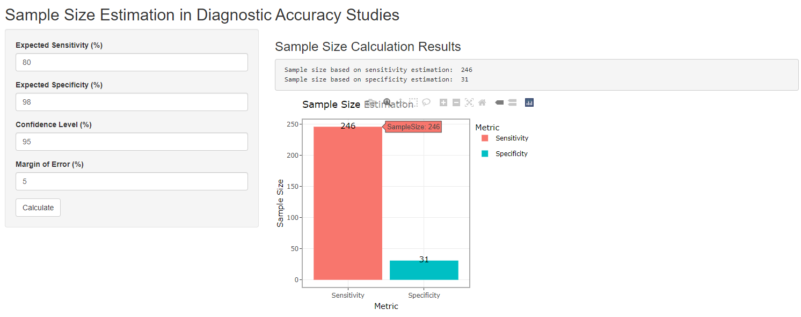

# Sample Size Estimation for Diagnostic Assays

--- 

## Overview
**SampleSizeEst.r** is an R Shiny application designed to calculate the sample size needed for diagnostic assays. 

The estimation relies on the formula for the margin of error (confidence interval width) for a proportion:
    n = Z^2 * p * (1-p) / E^2
where n is the required sample size, Z is the Z value corresponding to the desired confidence interval, p is the expected proportion (e.g. sensitivity or specificity), E is the desired margin of error.

The app allows users to input parameters such as sensitivity, specificity, confidence level, and margin of error, and returns the estimated sample size based on sensitivity and specificity inputs by both text outputs and an interactive bar plot.

---

## Prerequisites
R packages shiny, tidyverse, and plotly are required for the app.
Install the packages with conda
    
    conda install -c conda-forge r-tidyverse r-shiny r-plotly

## Run the Shiny application
Run the application in R
    
    shiny::runApp("SampleSizeEst.r")

